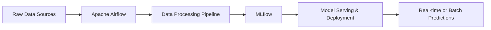
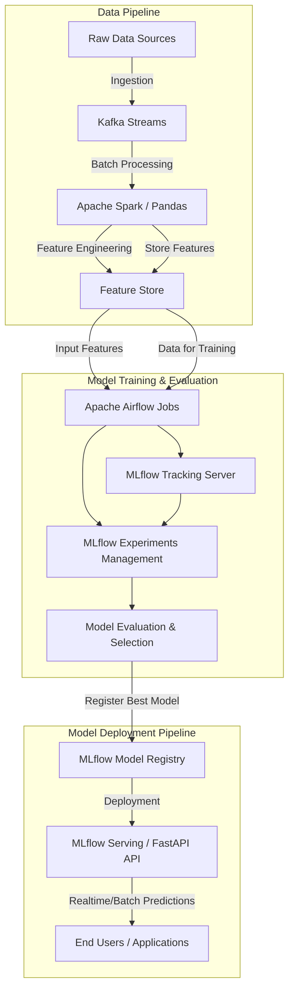
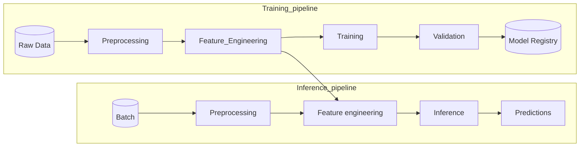
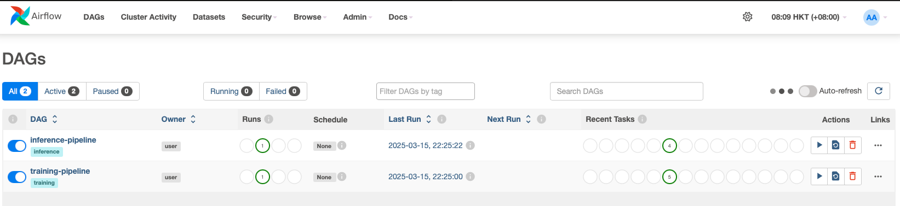
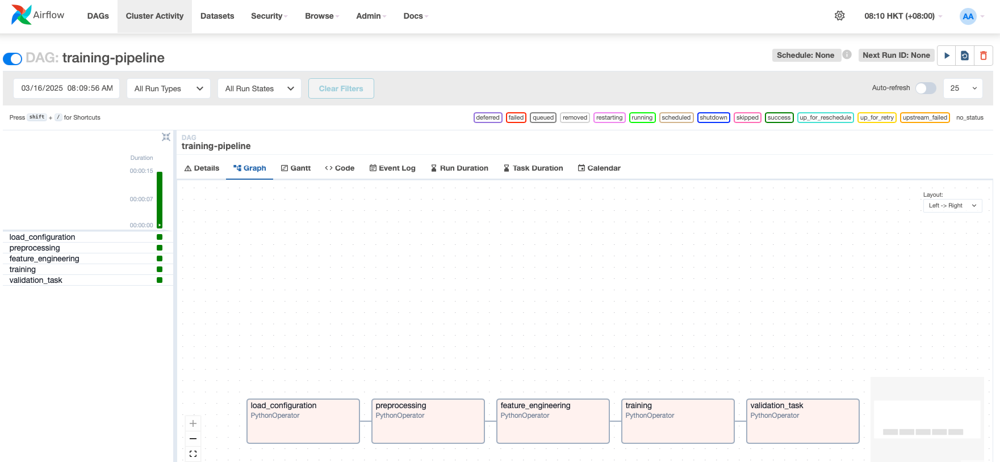
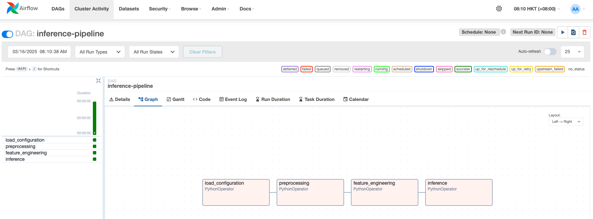

# Reservation Cancellation Forecasting

A machine learning project for predicting hotel reservation cancellations using **Apache Airflow, MLflow, PostgreSQL, MinIO, and Docker**.

## 📌 Table of Contents

- [Project Overview](#project-overview)
- [Features](#features)
- [Installation](#installation)
- [Usage](#usage)
- [Environment Variables](#environment-variables)
- [Project Structure](#project-structure)
- Airflow UI
- MLflow UI

---

## 📖 Project Overview

This project aims to **predict hotel reservation cancellations** using machine learning models. It is designed to be scalable and easy to deploy using **Docker and Apache Airflow**. The project includes:

- **Data ingestion & preprocessing**
- **Model training & evaluation**
- **Tracking & logging using MLflow**
- **Deployment using Apache Airflow & MinIO**

### 🔧 Tech Stack

- **Python** (Machine Learning & Data Processing)
- **Apache Airflow** (Workflow Orchestration)
- **PostgreSQL** (Database)
- **MinIO** (Object Storage)
- **MLflow** (Model Tracking)
- **Docker & Docker Compose** (Containerization)

---

## 🚀 Features

- **Automated Data Pipeline**: Uses Apache Airflow for scheduling and execution.
- **Model Tracking & Experimentation**: MLflow tracks model performance.
- **Scalable Architecture**: Deployable using Docker.
- **Object Storage Support**: MinIO stores model artifacts.

---
## Architecture Design
The architecture ensures scalability, modularity, reproducibility, and simplicity throughout the data science pipeline, from ingestion to deployment.
### High-level Overview Diagram


Overview

The integration of Apache Airflow and MLflow forms a robust machine learning pipeline that orchestrates and manages the end-to-end ML workflow. This architecture ensures data processing, model training, evaluation, versioning, and deployment are performed efficiently in an automated and reproducible manner.

⸻

MLflow Pipeline with Airflow

1. Data Ingestion and Preprocessing
	•	Source: Data is ingested from multiple sources, such as databases, streaming platforms (Kafka), or cloud storage.
	•	Processing: Apache Spark or Pandas is used to clean and prepare the data.
	•	Storage: Processed data is stored in a data lake or warehouse for further analysis.

2. Feature Engineering
	•	Features are generated using tools like Spark, Scikit-learn, or custom feature extraction scripts.
	•	Feature Store (e.g., Feast) can be used for consistent feature usage across training and inference.

3. Model Training and Evaluation
	•	Training: The model is trained using MLflow with different hyperparameters and datasets.
	•	Tracking: MLflow logs all experiments, including configurations, parameters, metrics, and model artifacts.
	•	Evaluation: The trained models are evaluated using standard ML metrics.

4. Model Registry and Versioning
	•	If a new model performs better than the currently deployed model, it is automatically registered in the MLflow Model Registry.
	•	Versioning ensures that previous models remain available for comparison and rollback.

5. Model Deployment and Inference
	•	The best-performing model is deployed using MLflow Serving, FastAPI, or cloud-based ML services.
	•	Inference Pipelines process real-time or batch predictions using Kafka and Apache Spark.
	•	Predictions and logs are stored and monitored for performance tracking and potential model drift detection.

MLflow Pipeline Architecture Using Apache Airflow




Key Components and Their Roles

1. Apache Airflow
	•	Orchestration Tool that manages the execution of ML pipeline steps using Directed Acyclic Graphs (DAGs).
	•	Automates data ingestion, preprocessing, training, evaluation, and deployment workflows.
	•	Integrates with various tools such as Kafka, Spark, MLflow, and cloud services.

2. Kafka (Streaming Data Processing)
	•	Used for real-time data ingestion and message streaming.
	•	Facilitates continuous ML model inference with real-time data pipelines.

3. MLflow (Model Lifecycle Management)
	•	Tracking Server logs metrics, parameters, and artifacts from experiments.
	•	Model Registry stores and manages different model versions.
	•	Deployment Tool enables serving models in production with REST APIs.

4. Apache Spark (Scalable Data Processing)
	•	Handles large-scale data processing for feature engineering and training.
	•	Supports real-time streaming inference using Spark Streaming.

⸻

Benefits of This Architecture

✔ Automation: Airflow schedules and automates ML pipeline tasks.

✔ Scalability: Spark and Kafka handle large datasets efficiently.

✔ Reproducibility: MLflow logs every experiment for easy retraining and debugging.

✔ Version Control: MLflow Model Registry ensures model versioning and tracking.

✔ Flexibility: The pipeline integrates with different ML frameworks and cloud services.

⸻

This architecture provides a robust, scalable, and reproducible machine learning workflow. Airflow manages the orchestration, Kafka handles streaming, MLflow tracks experiments and models, and Spark processes data efficiently. This setup is widely used in real-world ML production environments for continuous training and deployment.

## Machine Learning Pipeline



Now let’s explore building comprehensive machine-learning pipelines designed to effectively manage the lifecycle of ML models. Specifically, these pipelines will:

- Preprocess Data: Clean, format, and transform raw data to ensure quality and consistency, handling missing values, normalization, encoding categorical variables, and removing outliers.

- Perform Feature Engineering: Generate, select, and refine features to enhance model performance. This step includes creating meaningful new features, feature scaling, feature selection techniques, and reducing dimensionality if required.

- Train and Evaluate the Model: Utilize the processed and engineered data to train machine learning models. Evaluate their performance using appropriate metrics, cross-validation methods, and tuning hyperparameters to optimize predictive accuracy and generalization.

- Register New Model Versions: Automatically register and version the trained model in a centralized model registry if its performance surpasses the currently deployed model. This step involves comparing performance metrics, documenting improvements, and maintaining clear versioning for reproducibility and auditability.

- Perform Inferences: Deploy and use the registered model along with associated preprocessing and feature engineering steps to perform predictions on new batch or real-time data, ensuring consistency between training and inference workflows.

## 🛠 Installation
Clone the repository:
``` bash
git clone https://github.com/your-repo/reservation-cancellation-forecasting.git
cd reservation-cancellation-forecasting
```
Build and start the Docker environment:
``` bash
docker-compose build
docker-compose up -d
```
## ▶️ Usage & Examples
After successfully installing and starting the project:
- **Airflow Web Interface** is running at:
``` 
http://localhost:8080
```
- **MLflow Web Interface** is running at:
``` 
http://localhost:5000
```
- Trigger workflow directly from Airflow UI or CLI:
``` bash
docker-compose exec airflow-scheduler airflow dags trigger your_dag_id
```
## 📑 Environment Variables
Customize the project behavior via environment variables in the `.env` file:
- `AIRFLOW_IMAGE_NAME` (Docker image for Airflow)
- `_AIRFLOW_WWW_USER_USERNAME` & `_AIRFLOW_WWW_USER_PASSWORD` (Airflow Admin login)
- `_PIP_ADDITIONAL_REQUIREMENTS` (Any additional Python packages)

For full details, check the `.env.example` file provided in the source repository.
## 📂 Project Structure
``` 
.
├── airflow                 # Airflow-related code (DAGs, plugins, requirements)
│   └── dags                   
│   └── plugins              
├── data                    # Raw & processed data
├── notebooks               # Jupyter notebooks for exploratory analysis and modeling
├── scripts                 # Data/Model-related Python scripts
├── mlflow                  # Configuration and tracking files related to MLflow
├── .env                    # Environment variables file
├── docker-compose.yaml     # Docker Compose specifications
└── README.md
```
## 🌀 Airflow UI
- URL: [http://localhost:8080](http://localhost:8080)
- Default username & password:
``` 
  username: airflow
  password: airflow
```
## 🔍 MLflow UI
Track your experiments and models:
- MLflow is accessible at:
``` 
http://localhost:5000
```
## 📂 Project Structure
Clear and organized project structure for efficient collaboration:
``` 
reservation-cancellation-forecasting/
├── airflow/
│   ├── dags/
│   └── plugins/
├── data/
├── notebooks/
├── mlflow
├── scripts
├── docker-compose.yml              
├── Dockerfile             
├── requirements.txt        
├── README.md                
├── .env                     
```
## ⚠️ Important Notes
- This configuration is intended only for local development and testing.
- Do NOT use it directly in production without security hardening and proper resource scaling.
- For advanced use during development or production deployments, build customized Docker images that include all required dependencies.

---

## Airflow UI


## MLflow UI
