# Reservation Cancellation Forecasting

A machine learning project for predicting hotel reservation cancellations using **Apache Airflow, MLflow, PostgreSQL, MinIO, and Docker**.

---

## 📌 Table of Contents

- [Project Overview](#project-overview)
- [System Architecture](#system-architecture)
- [Technical Stack](#technical-stack)
- [Machine Learning Model Theory](#machine-learning-model-theory)
- [Airflow Implementation](#airflow-implementation)
- [Model Serving & Deployment](#model-serving--deployment)
- [MLflow Integration](#mlflow-integration)
- [Data Pipeline](#data-pipeline)
- [CI/CD Pipeline](#cicd-pipeline)
- [Installation](#installation)
- [Usage](#usage)
- [Environment Variables](#environment-variables)
- [Project Structure](#project-structure)

---

## 📖 Project Overview

This project aims to **predict hotel reservation cancellations** using machine learning models. It is designed to be scalable and easy to deploy using **Docker and Apache Airflow**. The project includes:

- **Data ingestion & preprocessing**
- **Model training & evaluation**
- **Tracking & logging using MLflow**
- **Deployment using Apache Airflow & MinIO**

## 🏗 System Architecture

### High-level System Architecture

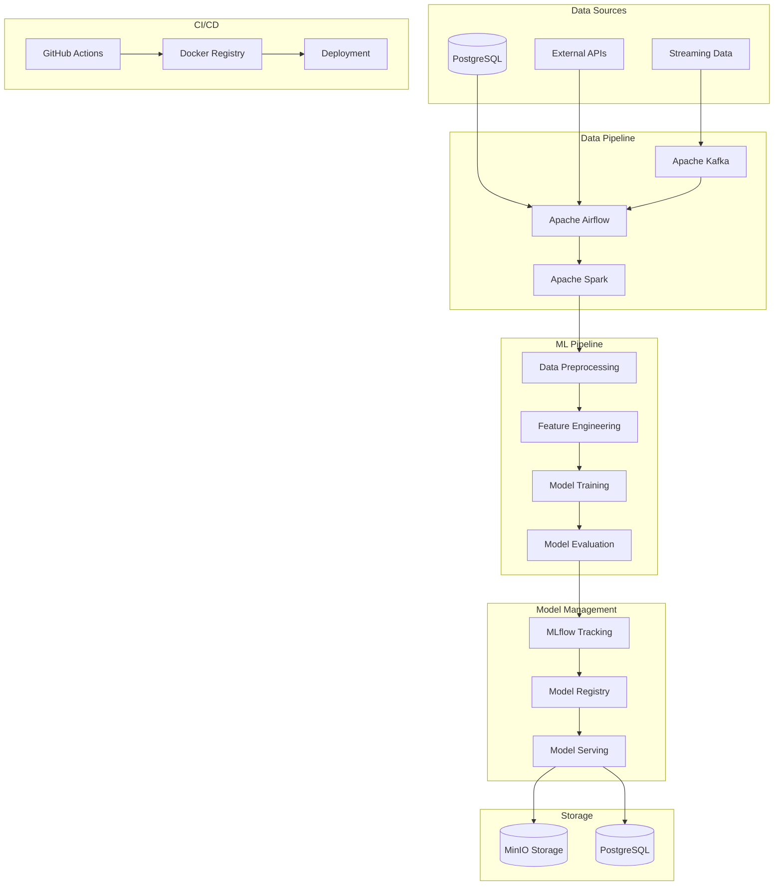

### Detailed Component Architecture

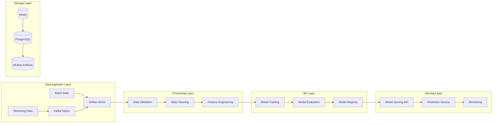

## 🔧 Technical Stack

### Core Technologies
- **Python 3.9+**: Primary programming language
- **Apache Airflow 2.7+**: Workflow orchestration
- **MLflow 2.8+**: Model tracking and management
- **PostgreSQL 14+**: Relational database
- **MinIO**: Object storage
- **Docker & Docker Compose**: Containerization

### ML & Data Processing
- **Scikit-learn**: Machine learning algorithms
- **Pandas**: Data manipulation
- **NumPy**: Numerical computing
- **Apache Spark**: Distributed computing
- **Apache Kafka**: Stream processing

### Monitoring & Logging
- **Prometheus**: Metrics collection
- **Grafana**: Visualization
- **ELK Stack**: Log management

### CI/CD Tools
- **GitHub Actions**: CI/CD pipeline
- **Docker Registry**: Container registry
- **Kubernetes**: Container orchestration

## 🤖 Machine Learning Model Theory

### Model Architecture

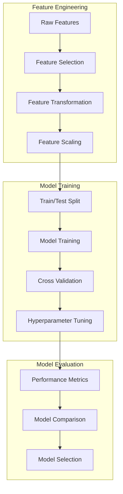

### Key Algorithms
1. **Random Forest Classifier**
   - Ensemble learning method
   - Handles non-linear relationships
   - Robust to overfitting

2. **XGBoost**
   - Gradient boosting framework
   - High performance on structured data
   - Built-in feature importance

3. **LightGBM**
   - Light Gradient Boosting Machine
   - Faster training speed
   - Lower memory usage

### Model Metrics
- Accuracy
- Precision
- Recall
- F1-Score
- ROC-AUC
- Confusion Matrix

## 🤖 Machine Learning Model Implementation

### Model Architecture

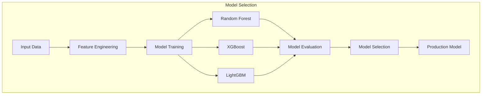

### Model Implementation Details

#### 1. Random Forest Classifier
```python
from sklearn.ensemble import RandomForestClassifier
from sklearn.model_selection import GridSearchCV

class RandomForestModel:
    def __init__(self):
        self.model = RandomForestClassifier(
            n_estimators=100,
            max_depth=10,
            min_samples_split=5,
            min_samples_leaf=2,
            random_state=42
        )
    
    def train(self, X_train, y_train):
        # Define parameter grid
        param_grid = {
            'n_estimators': [50, 100, 200],
            'max_depth': [5, 10, 15],
            'min_samples_split': [2, 5, 10]
        }
        
        # Perform grid search
        grid_search = GridSearchCV(
            self.model,
            param_grid,
            cv=5,
            scoring='f1'
        )
        
        # Fit the model
        grid_search.fit(X_train, y_train)
        
        # Update model with best parameters
        self.model = grid_search.best_estimator_
        
        return self.model
```

#### 2. XGBoost Classifier
```python
import xgboost as xgb

class XGBoostModel:
    def __init__(self):
        self.model = xgb.XGBClassifier(
            objective='binary:logistic',
            n_estimators=100,
            learning_rate=0.1,
            max_depth=6,
            random_state=42
        )
    
    def train(self, X_train, y_train):
        # Define parameter grid
        param_grid = {
            'n_estimators': [50, 100, 200],
            'learning_rate': [0.01, 0.1, 0.2],
            'max_depth': [3, 6, 9]
        }
        
        # Perform grid search
        grid_search = GridSearchCV(
            self.model,
            param_grid,
            cv=5,
            scoring='f1'
        )
        
        # Fit the model
        grid_search.fit(X_train, y_train)
        
        # Update model with best parameters
        self.model = grid_search.best_estimator_
        
        return self.model
```

#### 3. LightGBM Classifier
```python
import lightgbm as lgb

class LightGBMModel:
    def __init__(self):
        self.model = lgb.LGBMClassifier(
            objective='binary',
            n_estimators=100,
            learning_rate=0.1,
            num_leaves=31,
            random_state=42
        )
    
    def train(self, X_train, y_train):
        # Define parameter grid
        param_grid = {
            'n_estimators': [50, 100, 200],
            'learning_rate': [0.01, 0.1, 0.2],
            'num_leaves': [20, 31, 40]
        }
        
        # Perform grid search
        grid_search = GridSearchCV(
            self.model,
            param_grid,
            cv=5,
            scoring='f1'
        )
        
        # Fit the model
        grid_search.fit(X_train, y_train)
        
        # Update model with best parameters
        self.model = grid_search.best_estimator_
        
        return self.model
```

### Model Selection and Ensemble
```python
class ModelEnsemble:
    def __init__(self):
        self.models = {
            'random_forest': RandomForestModel(),
            'xgboost': XGBoostModel(),
            'lightgbm': LightGBMModel()
        }
        self.weights = None
    
    def train_models(self, X_train, y_train):
        trained_models = {}
        for name, model in self.models.items():
            trained_models[name] = model.train(X_train, y_train)
        return trained_models
    
    def predict(self, X):
        predictions = {}
        for name, model in self.models.items():
            predictions[name] = model.predict_proba(X)
        
        # Weighted ensemble prediction
        final_prediction = np.zeros(len(X))
        for name, pred in predictions.items():
            final_prediction += self.weights[name] * pred[:, 1]
        
        return (final_prediction > 0.5).astype(int)
```

### Why Multiple Models?

1. **Random Forest**
   - Handles non-linear relationships well
   - Robust to overfitting
   - Good for feature importance analysis
   - Works well with categorical and numerical features
   - Less sensitive to outliers

2. **XGBoost**
   - Excellent performance on structured data
   - Built-in feature importance
   - Handles missing values well
   - Good for imbalanced datasets
   - Efficient memory usage

3. **LightGBM**
   - Faster training speed
   - Lower memory usage
   - Better handling of categorical features
   - Good for large datasets
   - Efficient parallel learning

### Model Performance Comparison

```python
def evaluate_models(models, X_test, y_test):
    results = {}
    for name, model in models.items():
        y_pred = model.predict(X_test)
        results[name] = {
            'accuracy': accuracy_score(y_test, y_pred),
            'precision': precision_score(y_test, y_pred),
            'recall': recall_score(y_test, y_pred),
            'f1': f1_score(y_test, y_pred)
        }
    return results
```

### Model Selection Criteria

1. **Performance Metrics**
   - Accuracy
   - Precision
   - Recall
   - F1-score
   - ROC-AUC

2. **Business Requirements**
   - Prediction speed
   - Resource usage
   - Interpretability
   - Maintenance complexity

3. **Technical Considerations**
   - Training time
   - Memory requirements
   - Scalability
   - Integration complexity

## 🎯 Airflow Implementation

### DAG Structure

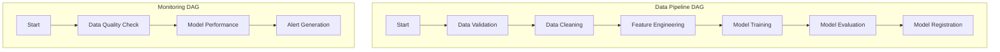

### Airflow DAG Implementation

#### 1. Basic DAG Structure
```python
from airflow import DAG
from airflow.operators.python import PythonOperator
from datetime import datetime, timedelta

default_args = {
    'owner': 'airflow',
    'depends_on_past': False,
    'start_date': datetime(2024, 1, 1),
    'email_on_failure': False,
    'email_on_retry': False,
    'retries': 1,
    'retry_delay': timedelta(minutes=5),
}

dag = DAG(
    'reservation_cancellation_pipeline',
    default_args=default_args,
    description='Pipeline for reservation cancellation prediction',
    schedule_interval=timedelta(days=1),
)
```

#### 2. Task Implementation
```python
def data_validation(**context):
    # Data validation logic
    pass

def data_cleaning(**context):
    # Data cleaning logic
    pass

def feature_engineering(**context):
    # Feature engineering logic
    pass

# Task definitions
validate_data = PythonOperator(
    task_id='validate_data',
    python_callable=data_validation,
    dag=dag,
)

clean_data = PythonOperator(
    task_id='clean_data',
    python_callable=data_cleaning,
    dag=dag,
)

engineer_features = PythonOperator(
    task_id='engineer_features',
    python_callable=feature_engineering,
    dag=dag,
)

# Task dependencies
validate_data >> clean_data >> engineer_features
```

#### 3. Sensor Implementation
```python
from airflow.sensors.filesystem import FileSensor

file_sensor = FileSensor(
    task_id='check_input_file',
    filepath='/path/to/input/file.csv',
    poke_interval=300,  # 5 minutes
    timeout=3600,  # 1 hour
    dag=dag,
)

file_sensor >> validate_data
```

#### 4. Error Handling
```python
from airflow.operators.python import ShortCircuitOperator

def check_data_quality(**context):
    # Data quality check logic
    return True  # or False to skip downstream tasks

quality_check = ShortCircuitOperator(
    task_id='quality_check',
    python_callable=check_data_quality,
    dag=dag,
)

quality_check >> clean_data
```

## 🚀 Model Serving & Deployment

### Deployment Architecture

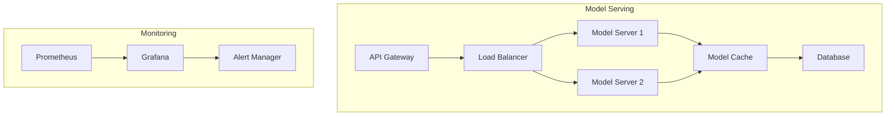

### Deployment Strategies
1. **Blue-Green Deployment**
   - Zero-downtime updates
   - Easy rollback
   - Traffic switching

2. **Canary Deployment**
   - Gradual rollout
   - Risk mitigation
   - Performance monitoring

## 📊 MLflow Integration

### MLflow Components

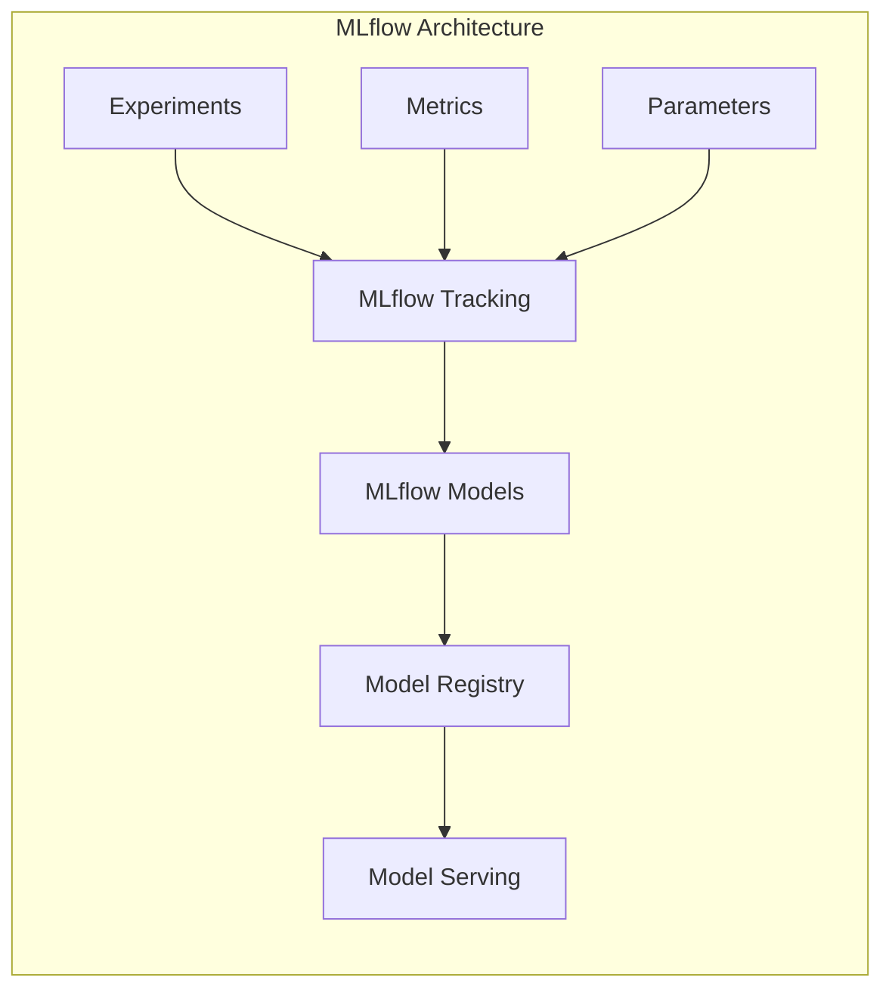

### Key Features
1. **Experiment Tracking**
   - Parameter logging
   - Metric tracking
   - Artifact storage

2. **Model Registry**
   - Version control
   - Stage transitions
   - Model lineage

## 📈 Data Pipeline

### Pipeline Architecture

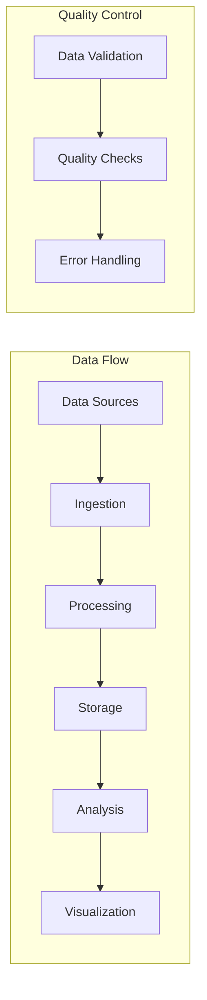

### Pipeline Implementation

#### 1. Data Ingestion
```python
class DataIngestion:
    def __init__(self, source_type: str):
        self.source_type = source_type

    def read_data(self):
        if self.source_type == 'csv':
            return pd.read_csv('data/raw/reservations.csv')
        elif self.source_type == 'api':
            return self._fetch_from_api()
        elif self.source_type == 'database':
            return self._fetch_from_db()

    def _fetch_from_api(self):
        # API data fetching logic
        pass

    def _fetch_from_db(self):
        # Database fetching logic
        pass
```

#### 2. Data Processing
```python
class DataProcessor:
    def __init__(self, data: pd.DataFrame):
        self.data = data

    def clean_data(self):
        # Remove duplicates
        self.data.drop_duplicates(inplace=True)
        
        # Handle missing values
        self.data.fillna(method='ffill', inplace=True)
        
        # Remove outliers
        self._remove_outliers()
        
        return self.data

    def _remove_outliers(self):
        # Outlier removal logic
        pass
```

#### 3. Feature Engineering
```python
class FeatureEngineer:
    def __init__(self, data: pd.DataFrame):
        self.data = data

    def create_features(self):
        # Create time-based features
        self._create_time_features()
        
        # Create categorical features
        self._create_categorical_features()
        
        # Create numerical features
        self._create_numerical_features()
        
        return self.data

    def _create_time_features(self):
        # Time feature creation logic
        pass

    def _create_categorical_features(self):
        # Categorical feature creation logic
        pass

    def _create_numerical_features(self):
        # Numerical feature creation logic
        pass
```

## 🏪 Feature Store Implementation

### Feature Store Architecture

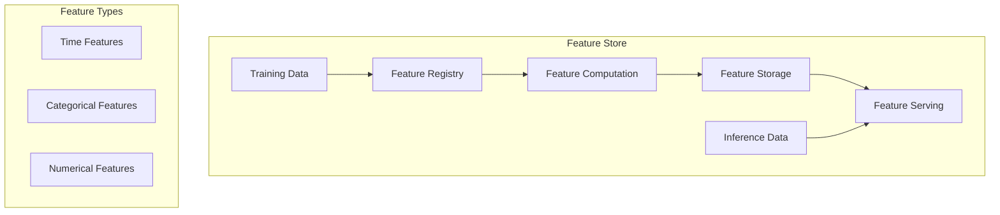

### Feature Store Implementation

#### 1. Feature Definition
```python
from feast import Entity, Feature, FeatureView, FileSource, ValueType
from datetime import timedelta

# Define entities
reservation = Entity(
    name="reservation_id",
    value_type=ValueType.INT64,
    description="Reservation identifier",
)

# Define feature views
reservation_features = FeatureView(
    name="reservation_features",
    entities=["reservation_id"],
    ttl=timedelta(days=365),
    features=[
        Feature(name="days_until_checkin", dtype=ValueType.INT64),
        Feature(name="total_guests", dtype=ValueType.INT64),
        Feature(name="room_type", dtype=ValueType.STRING),
        Feature(name="booking_channel", dtype=ValueType.STRING),
        Feature(name="previous_cancellations", dtype=ValueType.INT64),
    ],
    online=True,
    input=FileSource(
        path="data/features/reservation_features.parquet",
        timestamp_field="event_timestamp",
    ),
)
```

#### 2. Feature Computation
```python
class FeatureComputer:
    def __init__(self, data: pd.DataFrame):
        self.data = data

    def compute_features(self):
        features = {}
        
        # Compute time-based features
        features['days_until_checkin'] = self._compute_days_until_checkin()
        
        # Compute guest-related features
        features['total_guests'] = self._compute_total_guests()
        
        # Compute booking-related features
        features['booking_channel'] = self._get_booking_channel()
        
        return features

    def _compute_days_until_checkin(self):
        # Days until checkin computation logic
        pass

    def _compute_total_guests(self):
        # Total guests computation logic
        pass

    def _get_booking_channel(self):
        # Booking channel extraction logic
        pass
```

#### 3. Feature Storage
```python
class FeatureStorage:
    def __init__(self, feature_store_path: str):
        self.feature_store_path = feature_store_path

    def store_features(self, features: dict):
        # Convert features to DataFrame
        df = pd.DataFrame(features)
        
        # Store in parquet format
        df.to_parquet(
            f"{self.feature_store_path}/features.parquet",
            index=False
        )

    def load_features(self):
        return pd.read_parquet(
            f"{self.feature_store_path}/features.parquet"
        )
```

#### 4. Feature Serving
```python
class FeatureServer:
    def __init__(self, feature_store_path: str):
        self.feature_store_path = feature_store_path
        self.features = None

    def load_features(self):
        self.features = pd.read_parquet(
            f"{self.feature_store_path}/features.parquet"
        )

    def get_features(self, reservation_ids: list):
        if self.features is None:
            self.load_features()
        
        return self.features[
            self.features['reservation_id'].isin(reservation_ids)
        ]

    def get_feature_vector(self, reservation_id: int):
        if self.features is None:
            self.load_features()
        
        return self.features[
            self.features['reservation_id'] == reservation_id
        ].iloc[0]
```

### Feature Store Usage

#### 1. Training Data Generation
```python
def generate_training_data():
    # Initialize feature store
    feature_store = FeatureStorage("data/features")
    
    # Load features
    features = feature_store.load_features()
    
    # Split into train/test
    train_data, test_data = train_test_split(
        features,
        test_size=0.2,
        random_state=42
    )
    
    return train_data, test_data
```

#### 2. Inference Data Generation
```python
def generate_inference_data(reservation_ids: list):
    # Initialize feature server
    feature_server = FeatureServer("data/features")
    
    # Get features for inference
    inference_features = feature_server.get_features(reservation_ids)
    
    return inference_features
```

## 🔄 CI/CD Pipeline

### Pipeline Architecture

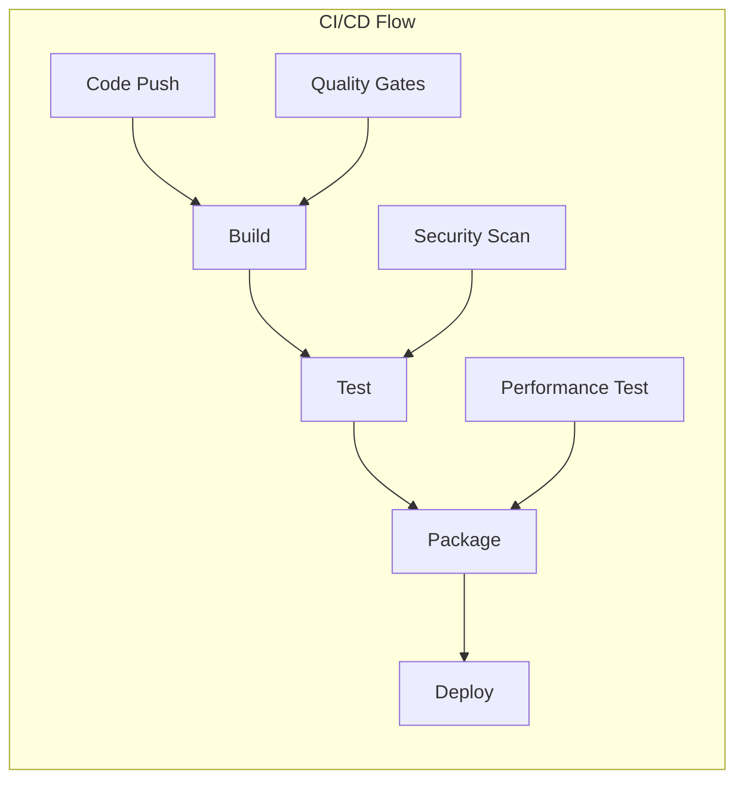

### CI/CD Components

#### 1. Continuous Integration
- **Code Quality**
  - Linting (flake8, black)
  - Type checking (mypy)
  - Code coverage (pytest-cov)
  - Documentation checks

- **Testing**
  - Unit tests
  - Integration tests
  - End-to-end tests
  - Performance tests

- **Security**
  - Dependency scanning
  - Code vulnerability scanning
  - Secrets management

#### 2. Continuous Deployment
- **Build**
  - Docker image creation
  - Version tagging
  - Artifact storage

- **Deployment**
  - Environment-specific configs
  - Rollback mechanisms
  - Health checks

- **Monitoring**
  - Deployment status
  - Performance metrics
  - Error tracking

### GitHub Actions Implementation

#### 1. Workflow Structure
```yaml
# .github/workflows/ci-cd.yml
name: CI/CD Pipeline

on:
  push:
    branches: [ main, develop ]
  pull_request:
    branches: [ main, develop ]

jobs:
  test:
    runs-on: ubuntu-latest
    steps:
      - uses: actions/checkout@v2
      - name: Set up Python
        uses: actions/setup-python@v2
        with:
          python-version: '3.9'
      - name: Install dependencies
        run: |
          python -m pip install --upgrade pip
          pip install -r requirements.txt
      - name: Run tests
        run: |
          pytest tests/
          flake8 .
          mypy .

  build:
    needs: test
    runs-on: ubuntu-latest
    steps:
      - uses: actions/checkout@v2
      - name: Build Docker image
        run: docker build -t reservation-cancellation .

  deploy:
    needs: build
    runs-on: ubuntu-latest
    if: github.ref == 'refs/heads/main'
    steps:
      - name: Deploy to production
        run: |
          # Deployment steps
```

#### 2. Step-by-Step Implementation Guide

1. **Setup GitHub Repository**
   ```bash
   # Initialize git repository
   git init
   
   # Add remote repository
   git remote add origin https://github.com/username/reservation-cancellation.git
   
   # Create main branch
   git checkout -b main
   ```

2. **Create GitHub Actions Directory**
   ```bash
   # Create workflows directory
   mkdir -p .github/workflows
   ```

3. **Configure Workflow Files**
   ```bash
   # Create main workflow file
   touch .github/workflows/ci-cd.yml
   
   # Create environment-specific workflows
   touch .github/workflows/staging.yml
   touch .github/workflows/production.yml
   ```

4. **Setup Environment Secrets**
   ```bash
   # Add secrets in GitHub repository settings
   # Settings > Secrets and variables > Actions
   # Add the following secrets:
   # - DOCKER_USERNAME
   # - DOCKER_PASSWORD
   # - AWS_ACCESS_KEY_ID
   # - AWS_SECRET_ACCESS_KEY
   ```

5. **Configure Branch Protection**
   ```bash
   # In GitHub repository settings:
   # Settings > Branches > Branch protection rules
   # Add rule for main branch:
   # - Require pull request reviews
   # - Require status checks to pass
   # - Require branches to be up to date
   ```

6. **Create Deployment Environments**
   ```bash
   # In GitHub repository settings:
   # Settings > Environments
   # Create environments:
   # - staging
   # - production
   ```

7. **Configure Deployment Workflow**
   ```yaml
   # .github/workflows/deploy.yml
   name: Deploy

   on:
     workflow_run:
       workflows: ["CI/CD Pipeline"]
       branches: [main]
       types:
         - completed

   jobs:
     deploy:
       runs-on: ubuntu-latest
       environment: production
       steps:
         - uses: actions/checkout@v2
         - name: Deploy to production
           run: |
             # Deployment commands
   ```

8. **Setup Monitoring and Alerts**
   ```yaml
   # .github/workflows/monitor.yml
   name: Monitor

   on:
     schedule:
       - cron: '*/5 * * * *'  # Every 5 minutes

   jobs:
     monitor:
       runs-on: ubuntu-latest
       steps:
         - name: Check application health
           run: |
             # Health check commands
   ```

### CI/CD Best Practices

1. **Code Quality**
   - Use pre-commit hooks for local validation
   - Implement automated code formatting
   - Enforce code review requirements

2. **Testing Strategy**
   - Maintain high test coverage
   - Implement parallel test execution
   - Use test matrices for different environments

3. **Security**
   - Regular dependency updates
   - Automated security scanning
   - Secrets management
   - Access control

4. **Deployment**
   - Blue-green deployments
   - Canary releases
   - Automated rollbacks
   - Environment-specific configurations

5. **Monitoring**
   - Real-time deployment status
   - Performance metrics
   - Error tracking
   - Automated alerts

### Troubleshooting Guide

1. **Common Issues**
   - Failed builds
   - Test failures
   - Deployment errors
   - Environment issues

2. **Debugging Steps**
   - Check workflow logs
   - Verify environment variables
   - Test locally
   - Review configuration

3. **Recovery Procedures**
   - Rollback deployment
   - Fix failing tests
   - Update dependencies
   - Reset environment

## 🛠 Installation
Clone the repository:
``` bash
git clone https://github.com/kihiu-ho/ReservationCancellationForecasting.git
cd reservation-cancellation-forecasting
```
Build and start the Docker environment:
``` bash
docker-compose build
docker-compose up -d
```
## ▶️ Usage & Examples
After successfully installing and starting the project:
- **Airflow Web Interface** is running at:
``` 
http://localhost:8080
```
- **MLflow Web Interface** is running at:
``` 
http://localhost:5000
```
- Trigger workflow directly from Airflow UI or CLI:
``` bash
docker-compose exec airflow-scheduler airflow dags trigger your_dag_id
```
## 📑 Environment Variables
Customize the project behavior via environment variables in the `.env` file:
- `AIRFLOW_IMAGE_NAME` (Docker image for Airflow)
- `_AIRFLOW_WWW_USER_USERNAME` & `_AIRFLOW_WWW_USER_PASSWORD` (Airflow Admin login)
- `_PIP_ADDITIONAL_REQUIREMENTS` (Any additional Python packages)

For full details, check the `.env.example` file provided in the source repository.
## 📂 Project Structure
``` 
.
├── airflow                 # Airflow-related code (DAGs, plugins, requirements)
│   └── dags                   
│   └── plugins              
├── data                    # Raw & processed data
├── notebooks               # Jupyter notebooks for exploratory analysis and modeling
├── scripts                 # Data/Model-related Python scripts
├── mlflow                  # Configuration and tracking files related to MLflow
├── .env                    # Environment variables file
├── docker-compose.yaml     # Docker Compose specifications
└── README.md
```
## 🌀 Airflow UI
- URL: [http://localhost:8080](http://localhost:8080)
- Default username & password:
``` 
  username: airflow
  password: airflow
```
## 🔍 MLflow UI
Track your experiments and models:
- MLflow is accessible at:
``` 
http://localhost:5500
```
## 📂 Project Structure
Clear and organized project structure for efficient collaboration:
``` 
reservation-cancellation-forecasting/
├── airflow/
│   ├── dags/
│   └── plugins/
├── data/
├── notebooks/
├── mlflow
├── scripts
├── docker-compose.yml              
├── Dockerfile             
├── requirements.txt        
├── README.md                
├── .env                     
```
## ⚠️ Important Notes
- This configuration is intended only for local development and testing.
- Do NOT use it directly in production without security hardening and proper resource scaling.
- For advanced use during development or production deployments, build customized Docker images that include all required dependencies.

---

## Airflow UI


## MLflow UI
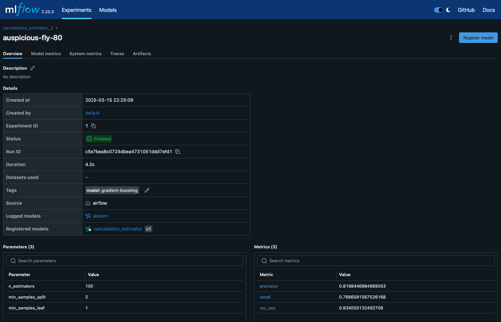