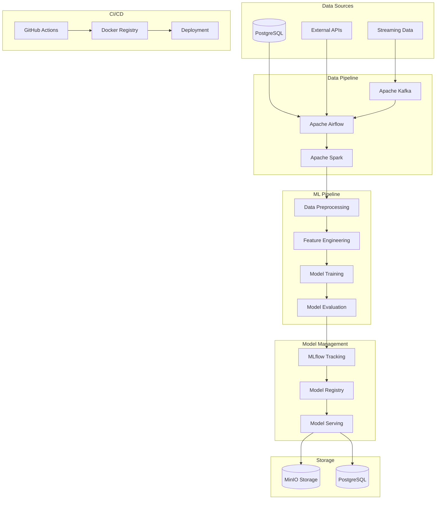
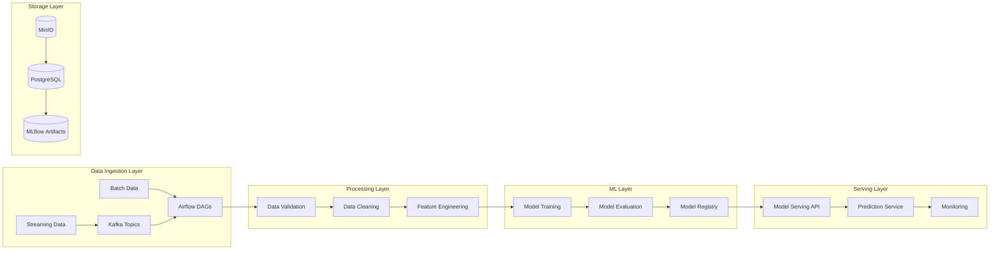
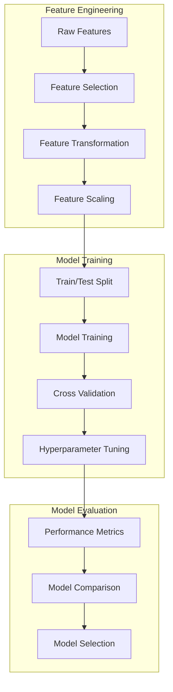
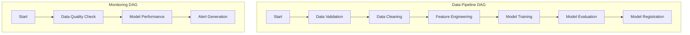
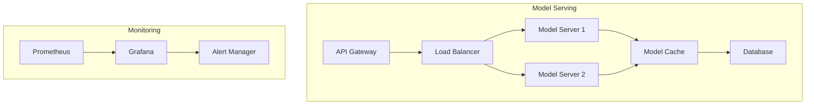
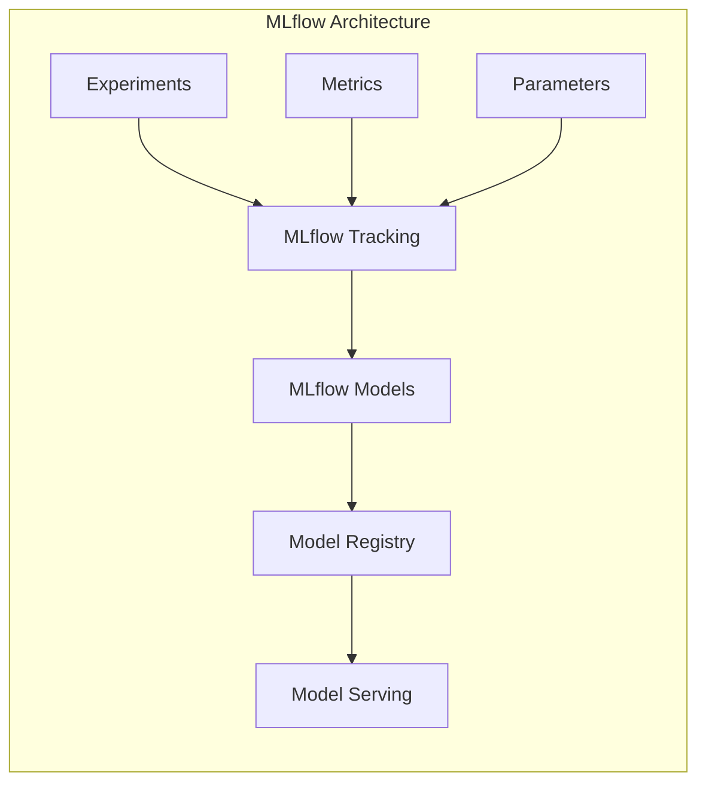
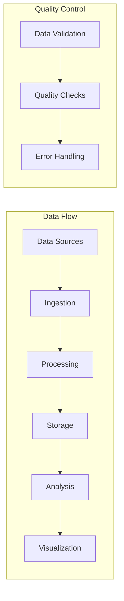
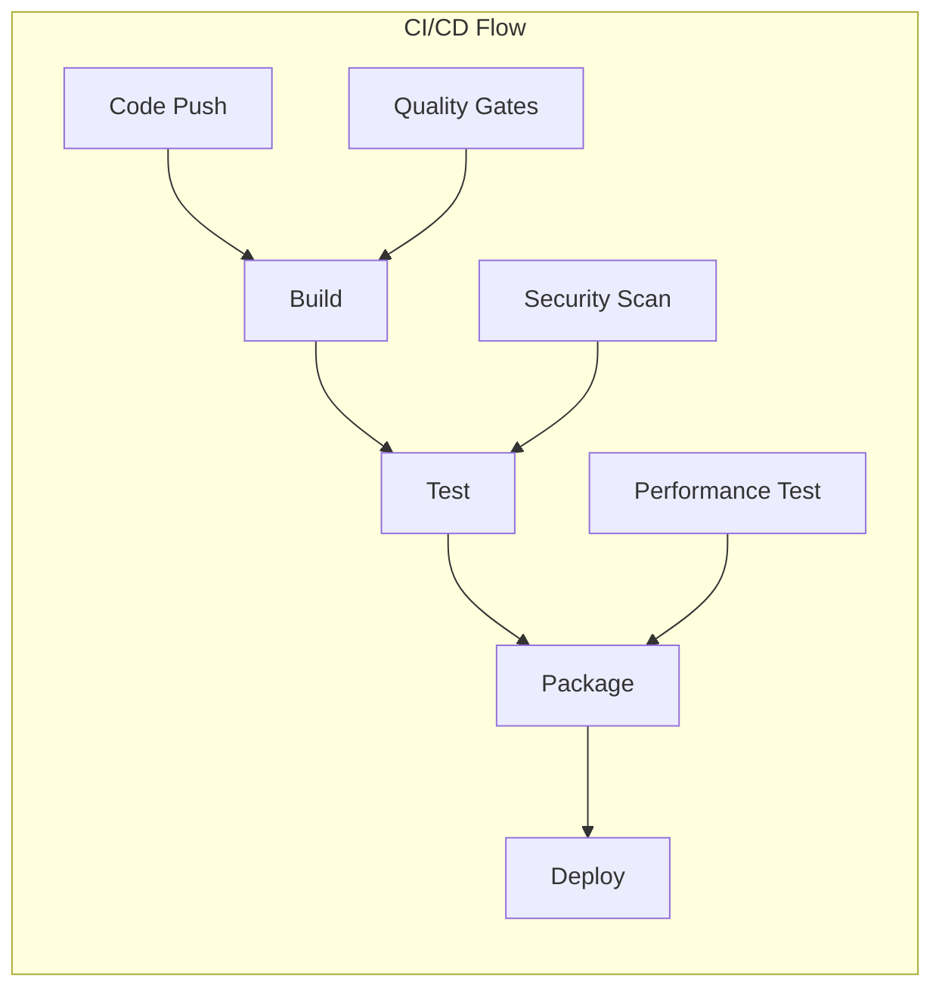
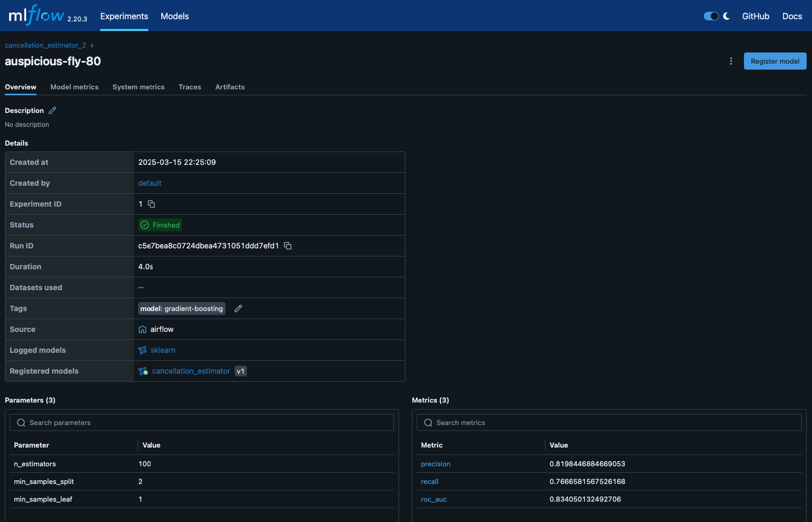

# Reservation Cancellation Forecasting

A machine learning project for predicting hotel reservation cancellations using **Apache Airflow, MLflow, PostgreSQL, MinIO, and Docker**.

---

## 📌 Table of Contents

- [Project Overview](#project-overview)
- [System Architecture](#system-architecture)
- [Technical Stack](#technical-stack)
- [Machine Learning Model Theory](#machine-learning-model-theory)
- [Airflow Implementation](#airflow-implementation)
- [Model Serving & Deployment](#model-serving--deployment)
- [MLflow Integration](#mlflow-integration)
- [Data Pipeline](#data-pipeline)
- [CI/CD Pipeline](#cicd-pipeline)
- [Installation](#installation)
- [Usage](#usage)
- [Environment Variables](#environment-variables)
- [Project Structure](#project-structure)

---

## 📖 Project Overview

This project aims to **predict hotel reservation cancellations** using machine learning models. It is designed to be scalable and easy to deploy using **Docker and Apache Airflow**. The project includes:

- **Data ingestion & preprocessing**
- **Model training & evaluation**
- **Tracking & logging using MLflow**
- **Deployment using Apache Airflow & MinIO**

## 🏗 System Architecture

### High-level System Architecture



### Detailed Component Architecture



## 🔧 Technical Stack

### Core Technologies
- **Python 3.9+**: Primary programming language
- **Apache Airflow 2.7+**: Workflow orchestration
- **MLflow 2.8+**: Model tracking and management
- **PostgreSQL 14+**: Relational database
- **MinIO**: Object storage
- **Docker & Docker Compose**: Containerization

### ML & Data Processing
- **Scikit-learn**: Machine learning algorithms
- **Pandas**: Data manipulation
- **NumPy**: Numerical computing
- **Apache Spark**: Distributed computing
- **Apache Kafka**: Stream processing

### Monitoring & Logging
- **Prometheus**: Metrics collection
- **Grafana**: Visualization
- **ELK Stack**: Log management

### CI/CD Tools
- **GitHub Actions**: CI/CD pipeline
- **Docker Registry**: Container registry
- **Kubernetes**: Container orchestration

## 🤖 Machine Learning Model Theory

### Model Architecture



### Key Algorithms
1. **Random Forest Classifier**
   - Ensemble learning method
   - Handles non-linear relationships
   - Robust to overfitting

2. **XGBoost**
   - Gradient boosting framework
   - High performance on structured data
   - Built-in feature importance

3. **LightGBM**
   - Light Gradient Boosting Machine
   - Faster training speed
   - Lower memory usage

### Model Metrics
- Accuracy
- Precision
- Recall
- F1-Score
- ROC-AUC
- Confusion Matrix

## 🎯 Airflow Implementation

### DAG Structure



### Task Dependencies
1. **Data Ingestion Tasks**
   - Validate input data
   - Check data quality
   - Transform data format

2. **Processing Tasks**
   - Clean data
   - Engineer features
   - Prepare training data

3. **ML Tasks**
   - Train models
   - Evaluate performance
   - Register best model

## 🚀 Model Serving & Deployment

### Deployment Architecture



### Deployment Strategies
1. **Blue-Green Deployment**
   - Zero-downtime updates
   - Easy rollback
   - Traffic switching

2. **Canary Deployment**
   - Gradual rollout
   - Risk mitigation
   - Performance monitoring

## 📊 MLflow Integration

### MLflow Components



### Key Features
1. **Experiment Tracking**
   - Parameter logging
   - Metric tracking
   - Artifact storage

2. **Model Registry**
   - Version control
   - Stage transitions
   - Model lineage

## 📈 Data Pipeline

### Pipeline Architecture



### Pipeline Components
1. **Data Ingestion**
   - Batch processing
   - Stream processing
   - API integration

2. **Data Processing**
   - Cleaning
   - Transformation
   - Feature engineering

3. **Data Storage**
   - Raw data
   - Processed data
   - Model artifacts

## 🔄 CI/CD Pipeline

### Pipeline Architecture



### Pipeline Stages
1. **Continuous Integration**
   - Code review
   - Unit testing
   - Integration testing

2. **Continuous Deployment**
   - Container building
   - Image pushing
   - Deployment automation

## 🛠 Installation
Clone the repository:
``` bash
git clone https://github.com/kihiu-ho/ReservationCancellationForecasting.git
cd reservation-cancellation-forecasting
```
Build and start the Docker environment:
``` bash
docker-compose build
docker-compose up -d
```
## ▶️ Usage & Examples
After successfully installing and starting the project:
- **Airflow Web Interface** is running at:
``` 
http://localhost:8080
```
- **MLflow Web Interface** is running at:
``` 
http://localhost:5000
```
- Trigger workflow directly from Airflow UI or CLI:
``` bash
docker-compose exec airflow-scheduler airflow dags trigger your_dag_id
```
## 📑 Environment Variables
Customize the project behavior via environment variables in the `.env` file:
- `AIRFLOW_IMAGE_NAME` (Docker image for Airflow)
- `_AIRFLOW_WWW_USER_USERNAME` & `_AIRFLOW_WWW_USER_PASSWORD` (Airflow Admin login)
- `_PIP_ADDITIONAL_REQUIREMENTS` (Any additional Python packages)

For full details, check the `.env.example` file provided in the source repository.
## 📂 Project Structure
``` 
.
├── airflow                 # Airflow-related code (DAGs, plugins, requirements)
│   └── dags                   
│   └── plugins              
├── data                    # Raw & processed data
├── notebooks               # Jupyter notebooks for exploratory analysis and modeling
├── scripts                 # Data/Model-related Python scripts
├── mlflow                  # Configuration and tracking files related to MLflow
├── .env                    # Environment variables file
├── docker-compose.yaml     # Docker Compose specifications
└── README.md
```
## 🌀 Airflow UI
- URL: [http://localhost:8080](http://localhost:8080)
- Default username & password:
``` 
  username: airflow
  password: airflow
```
## 🔍 MLflow UI
Track your experiments and models:
- MLflow is accessible at:
``` 
http://localhost:5500
```
## 📂 Project Structure
Clear and organized project structure for efficient collaboration:
``` 
reservation-cancellation-forecasting/
├── airflow/
│   ├── dags/
│   └── plugins/
├── data/
├── notebooks/
├── mlflow
├── scripts
├── docker-compose.yml              
├── Dockerfile             
├── requirements.txt        
├── README.md                
├── .env                     
```
## ⚠️ Important Notes
- This configuration is intended only for local development and testing.
- Do NOT use it directly in production without security hardening and proper resource scaling.
- For advanced use during development or production deployments, build customized Docker images that include all required dependencies.

---

## Airflow UI


## MLflow UI
